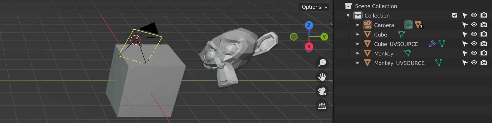
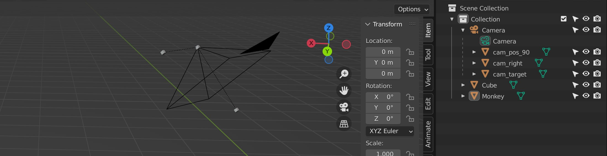

# transfer-maps - convert textures to new UV layouts

Simple Unity app to transfer textures between UV-layouts, as I feel baking in Blender is too cumbersome/slow/error prone. Ideally this would be more integrated, perhaps as a Blender add-on, but for now just use OBJ...

## Usage
 - Make sure each object has only 1 material
 - Make sure object names are unique
 - Duplicate object(s) in your 3D app and add `_OLDUV` as postfix
 - Change the UV coords of the original object to the new/desired UV layout.
 - Export as OBJ with the option "Material Groups" enabled
 - Drop OBJ file on TransferMaps.exe (or drop OBJ file on the application window)
 - Output PNGs will be saved next to TransferMaps.exe

## Features
 - Supports multi-export using UDIM-tiles, each (used) tile will be exported as a separate texture
 - Multiple objects/materials/textures can use the same UDIM-tile (make sure exported correctly to MTL file) 
 - Alpha channel Support
 - Adds a margin to avoid seams when mipmapping 
 - Configurable texture size and margin size in config.json

## Other things to note
 - ***NO WARRANTY, USE AT YOUR OWN RISK!***
 - No HDR support (only 8bit per channel)
 - Limited texture support (jpg and png should be fine!) 
 - Limited texture size, I assume 16k is maximum.
 - Only tested for blender workflow on windows.
 - File output and cfg uses the same dir as the exe, for use on macOS this would be need to be reworked
 - It will try to read all source textures into gpu memory (so you might not want to do too much at once)

## Projection
If you assign UVs based on projection from a camera with low-poly geometry, you will get distortion using the `_OLDUV` method. As an alternative you can specify a global camera transform, and it will then be projected for each pixel. Unfortunately the OBJ format don't really support transforms, so you need to create boxes to mark the camera position and camera target. Note that projection is only attempted for objects that have no matching `_OLDUV` object.

 * `cam_pos_90` - use this naming for mesh defining the camera position, the number is the FOV in degrees, ***optionally you can add lens shift x and y*** (for example `cam_pos_90_0.2_-0.1`)
 * `cam_target` - use this naming for mesh defining the camera target
 * `cam_right`  - (optional) use this naming for mesh defining the camera right (needed for camera with roll)

## License

Uses the same license as Blender (GLP v3)

## 3rd party code
 * OBJ run-time importer by Dummiesman (slightly modified)
 * Windows drag'n drop support by Markus Göbel (Bunny83)
 * MiniJSON by Calvin Rien / Patrick van Bergen
