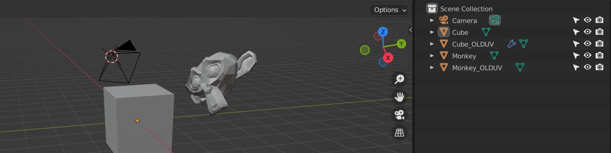

# transfer-maps - convert textures to new UV layouts

I made this simple Unity app to be able to transfer maps between UV-set, as I feel baking is too cumbersome/slow/error prone.

## Usage
 - Duplicate objects in your 3D app and add `_UVSOURCE` as postfix
 - Change the UV coords of the original object to the new/desired UV layout.
 - Export as OBJ with the option "Material Groups" enabled
 - Drop OBJ file on TransferMaps.exe (or drop OBJ file on the application window)
 - Output PNGs will be saved next to TransferMaps.exe

## Features
 - Supports multi export using UDIMS (each used UDIM will export as separate texture)
 - Each UDIM can have multiple texture sources (make sure exported correctly to MTL file) 
 - Alpha channel Support
 - Adds a margin to avoid seams when mipmapping 
 - Configurable texture size and margin size in config.json

## Other things to note
 - ***NO WARRANTY, USE AT YOUR OWN RISK***
 - No HDR (only 8bit per channel)
 - Limited texture support (jpg and png should be fine!) 
 - Limited texture size, I assume 16k is maximum.
 - Only tested for blender workflow on windows.
 - File output and cfg uses the same dir as the exe, for use on macos this would be need to be reworked
 - It will try to read all source textures into gpu memory (so you might not want to do too much at once)

## Projection
If you project from a camera to low poly geometry, you will get distortion using the `_UVSOURCE` method. As an alternative you can specify a global camera transform. Unfortunately the OBJ format don't really handle this well, so you need to create boxes to mark the camera position and camera target. Note that projection is only attempted for objects that have no matching `_UVSOURCE` object.

    cam_pos_90 - use this naming for mesh defining the camera position, the last number is the FOV in degrees
    cam_target - use this naming for mesh defining the camera target
    cam_right  - (optional) use this naming for mesh defining the camera right (needed for camera with roll)

## License and 3rd party components

This uses the same license as Blender (GLP v3)

## 3rd party code
 * OBJ run-time importer by Dummiesman (slightly modified by me)
 * Windows drag'n drop support by Markus Göbel (Bunny83)
 * MiniJSON by Calvin Rien / Patrick van Bergen
